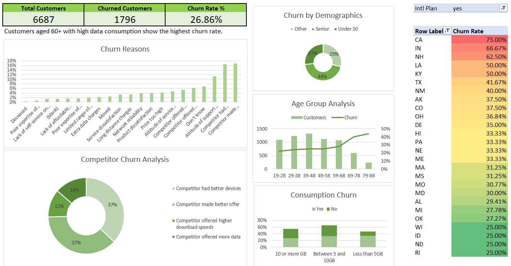

# 📊 Customer Churn Analysis

## 🔍 Project Overview
This project focuses on analyzing customer churn for a telecom company using Excel.  
The goal is to identify key factors driving customer attrition and present insights through an interactive dashboard that supports data-driven decision-making.

## 📁 Dataset Description
The dataset consists of customer-level data and aggregated summaries:
- **Customer demographics** (age, gender, senior status)
- **Contract details** (contract type, tenure)
- **Service usage & charges** (data consumption, monthly charges)
- **Churn status and churn reasons**

Each row in the customer dataset represents a single customer.

## 🛠 Tools Used
- Microsoft Excel
- Pivot Tables
- Charts & Conditional Formatting
- Dashboard Design

## 📊 Dashboard Overview
The dashboard provides a high-level overview of churn behavior, including:
- Overall churn rate and customer counts
- Churn by demographics and age groups
- Churn reasons and competitor analysis
- Churn distribution across states
- Consumption-based churn patterns

## 📈 Key Insights
- Customers aged **60+** show the highest churn rate, especially with high data consumption.
- **Month-to-month contracts** are strongly associated with higher churn.
- High **monthly charges** increase the likelihood of churn.
- Competitor offers are the leading reason for customer churn.
- Certain states consistently show higher churn rates than the overall average.

## 💡 Business Recommendations
- Encourage long-term contracts through discounts or loyalty programs.
- Provide targeted offers for high-risk customers with high monthly charges.
- Improve service quality and pricing to compete with competitors.
- Focus retention efforts on senior customers with high usage patterns.

## 📌 Conclusion
This project demonstrates how Excel can be used to perform end-to-end data analysis and create business-ready dashboards that translate data into actionable insights.
