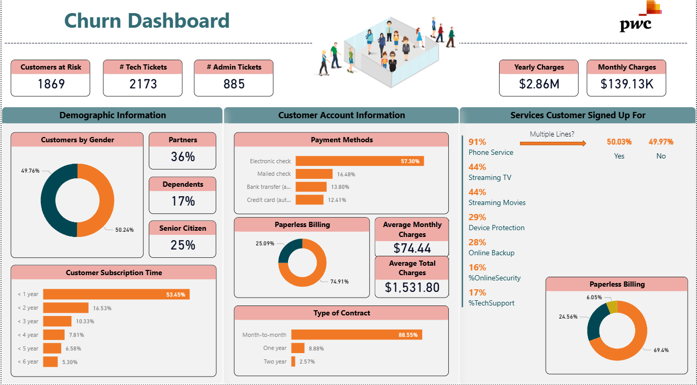
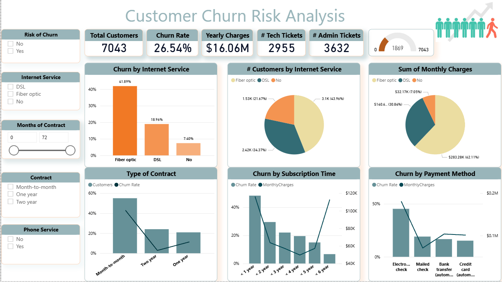

# 📊 Customer Churn Risk Analysis

## 🔍 Project Overview
This project focuses on analyzing customer churn risk for a telecom company using historical customer and service data.  
The objective is to identify key churn drivers, understand customer behavior, and deliver actionable insights through interactive dashboards to support customer retention strategies.

---

## 📁 Dataset Description
The dataset contains customer-level records where each row represents a single customer, including:

- **Customer demographics** (gender, senior citizen, partner, dependents)
- **Account information** (tenure, contract type, payment method)
- **Subscribed services** (internet service, streaming, security, tech support)
- **Billing details** (monthly charges, total charges, paperless billing)
- **Customer interaction metrics** (number of admin & tech tickets)
- **Churn status** (Yes / No)

---

## 🛠 Tools Used
- Microsoft Excel (data cleaning & preparation)
- Power BI (data modeling & dashboard design)
- DAX (KPI & churn calculations)
- Git & GitHub (version control & portfolio publishing)

---

## 📊 Dashboard Overview
The project includes two dashboards:

### 🔹 Churn Overview Dashboard
- Customers at risk
- Churn rate
- Monthly and yearly charges
- Ticket volumes (technical & administrative)
- Customer demographics and account characteristics

### 🔹 Churn Risk Analysis Dashboard
- Churn rate by contract type
- Churn by internet service
- Churn by tenure (subscription time)
- Churn by payment method
- Revenue impact of churn

---

## 📈 Key Insights
- Overall churn rate is approximately **26.5%**, indicating a significant retention challenge.
- **Month-to-month contracts** show the highest churn rates.
- Customers with **short tenure (less than 1 year)** are most likely to churn.
- **Fiber optic internet users** experience higher churn despite generating higher revenue.
- Customers using **electronic check payment methods** churn more than those using automatic payments.
- High numbers of **technical support tickets** strongly correlate with churn risk.

---

## 💡 Business Recommendations
- Encourage long-term contracts through discounts and loyalty programs.
- Focus retention efforts during the first 12 months of customer onboarding.
- Improve technical support quality for high-value services.
- Promote automatic payment methods to reduce churn.
- Design targeted offers for senior customers and high-risk segments.

---

## 📌 Conclusion
This project demonstrates how customer churn data can be transformed into business-ready insights using Power BI, enabling organizations to proactively reduce churn and protect recurring revenue.
